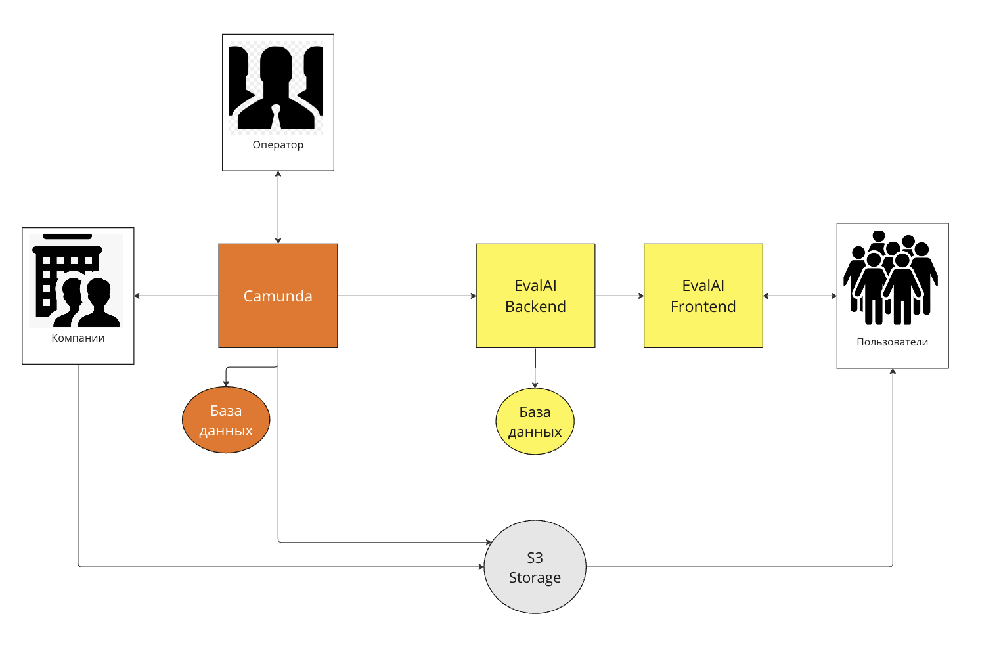

# Подключение workflow компоненты к EvalAI платформе

Курсовой проект Сотников Даниила, 2 курс

## Цель
Целью данного проекта является разработка платформы для хранения и распространения массивов данных для машинного обучения.

## Реализованный функционал
Реализовано 2 бизнес процесса на базе платформы Camunda:
регистрация организации - владельца массива данных;
загрузка массивов данных
Смоделированы процессы в формате BPMN
Реализованы задачи на языке Kotlin
Процессы включают в себя обработку XML данных, а также формирование XML и PDF документов.

## Схема системы

